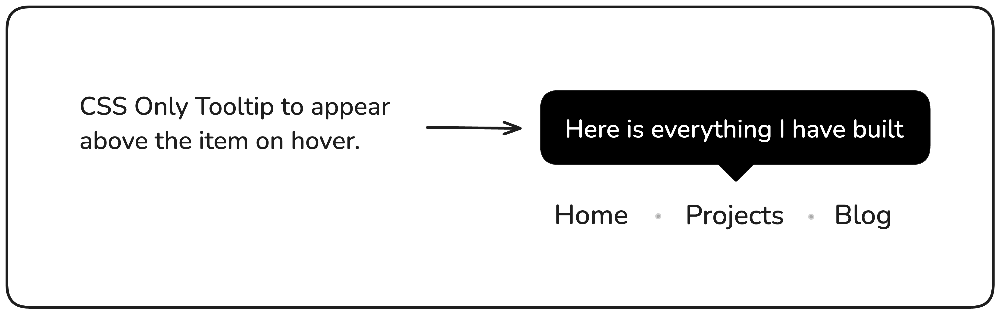
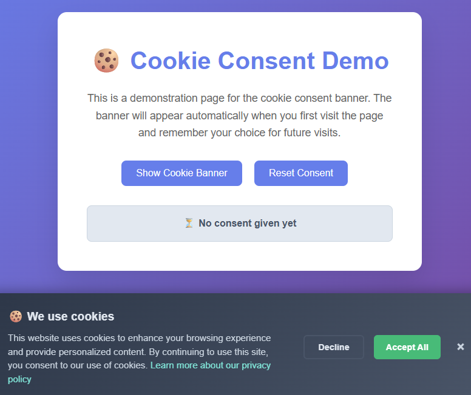

# 🚀 Frontend Projects (roadmap.sh)

This repository contains my solutions for the [Frontend Projects](https://roadmap.sh/frontend/projects).  
Each project includes a preview, source code, and a live demo hosted on **GitHub Pages**.

---

## 📂 Projects Table

| Project                                                                | Preview                                              | Code                                       | Live Demo                                                                                            |
| ---------------------------------------------------------------------- | ---------------------------------------------------- | ------------------------------------------ | ---------------------------------------------------------------------------------------------------- |
| [Single-Page CV](https://roadmap.sh/projects/single-page-cv)           |       | [View Code](projects/single-page-cv/)      | [Live Demo](https://ibraheamit.github.io/frontend-projects-roadmap.sh/projects/single-page-cv/)      |
| [Basic HTML Website](https://roadmap.sh/projects/basic-html-website)   |   | [View Code](projects/basic-html-website/)  | [Live Demo](https://ibraheamit.github.io/frontend-projects-roadmap.sh/projects/basic-html-website/)  |
| [Personal Portfolio](https://roadmap.sh/projects/portfolio-website)    |   | [View Code](projects/personal-portfolio/)  | [Live Demo](https://ibraheamit.github.io/frontend-projects-roadmap.sh/projects/personal-portfolio/)  |
| [Changelog Component](https://roadmap.sh/projects/changelog-component) |  | [View Code](projects/changelog-component/) | [Live Demo](https://ibraheamit.github.io/frontend-projects-roadmap.sh/projects/changelog-component/) |
| [Testimonial Cards](https://roadmap.sh/projects/testimonial-cards)     |    | [View Code](projects/testimonial-cards/)   | [Live Demo](https://ibraheamit.github.io/frontend-projects-roadmap.sh/projects/testimonial-cards/)   |
| [Datepicker UI](https://roadmap.sh/projects/datepicker-ui)             |        | [View Code](projects/datepicker-ui/)       | [Live Demo](https://ibraheamit.github.io/frontend-projects-roadmap.sh/projects/datepicker-ui/)       |
| [Accessible Form UI](https://roadmap.sh/projects/accessible-form-ui)   |   | [View Code](projects/accessible-form-ui/)  | [Live Demo](https://ibraheamit.github.io/frontend-projects-roadmap.sh/projects/accessible-form-ui/)  |
| [Image Grid Layout](https://roadmap.sh/projects/image-grid)            |           | [View Code](projects/image-grid/)          | [Live Demo](https://ibraheamit.github.io/frontend-projects-roadmap.sh/projects/image-grid/)          |
| [Tooltip UI](https://roadmap.sh/projects/tooltip-ui)                   |           | [View Code](projects/tooltip-ui/)          | [Live Demo](https://ibraheamit.github.io/frontend-projects-roadmap.sh/projects/tooltip-ui/)          |
| [Tabs](https://roadmap.sh/projects/simple-tabs)                        |          | [View Code](projects/simple-tabs/)         | [Live Demo](https://ibraheamit.github.io/frontend-projects-roadmap.sh/projects/simple-tabs/)         |
| [Cookie Consent](https://roadmap.sh/projects/cookie-consent)           |       | [View Code](projects/cookie-consent/)      | [Live Demo](https://ibraheamit.github.io/frontend-projects-roadmap.sh/projects/cookie-consent/)      |
| [Restricted Textarea](https://roadmap.sh/projects/restricted-textarea) |  | [View Code](projects/restricted-textarea/) | [Live Demo](https://ibraheamit.github.io/frontend-projects-roadmap.sh/projects/restricted-textarea/) |

---

## 🌍 Connect with me

- 🧑‍💻 GitHub: [ibraheamit](https://github.com/ibraheamit)
- 🎯 CSSBattle: [ibrahimit](https://cssbattle.dev/player/ibrahimit)
- 🛠️ Roadmap.sh: [roadmap.sh](https://roadmap.sh/u/ibraheamit)

## 💡 Tips for Learners

- Start small, focus on **writing clean and semantic HTML**.
- Use **CSS Flexbox & Grid** for layout instead of unnecessary hacks.
- Don’t copy-paste, try to solve each challenge step by step.
- Deploy your projects with **GitHub Pages** so others can see your work live.
