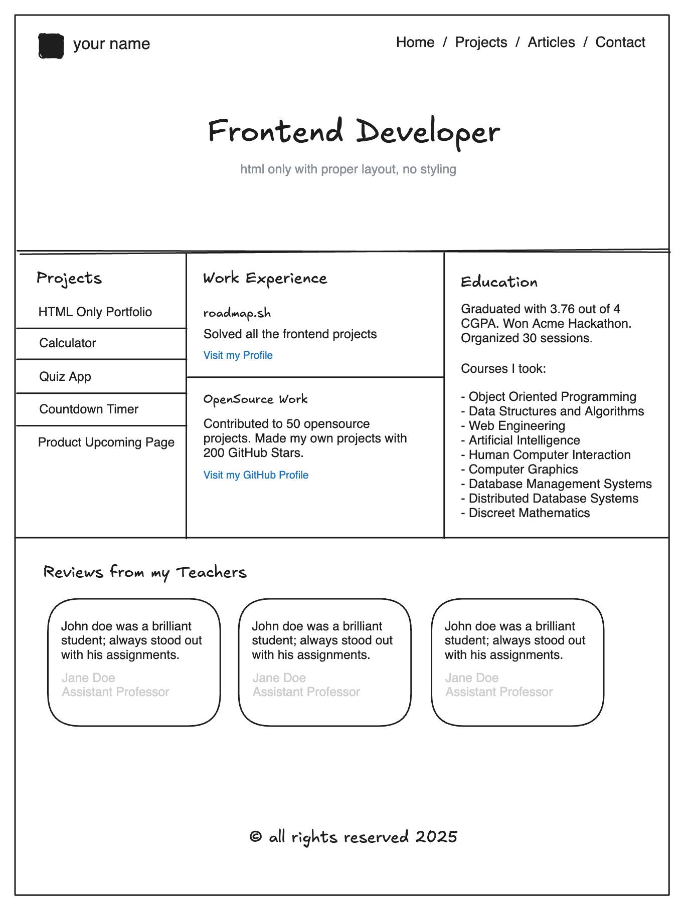

# 🚀 Frontend Projects (roadmap.sh)

This repository contains my solutions for the [Frontend Projects](https://roadmap.sh/frontend/projects).  
Each project includes a preview, source code, and a live demo hosted on **GitHub Pages**.

---

## 📂 Projects Table

| Project                                                              | Preview                                             | Code                                      | Live Demo                                                                                           |
| -------------------------------------------------------------------- | --------------------------------------------------- | ----------------------------------------- | --------------------------------------------------------------------------------------------------- |
| [Single-Page CV](https://roadmap.sh/projects/single-page-cv)         |      | [View Code](projects/single-page-cv/)     | [Live Demo](https://ibraheamit.github.io/frontend-projects-roadmap.sh/projects/single-page-cv/)     |
| [Basic HTML Website](https://roadmap.sh/projects/basic-html-website) |  | [View Code](projects/basic-html-website/) | [Live Demo](https://ibraheamit.github.io/frontend-projects-roadmap.sh/projects/basic-html-website/) |
| [Personal Portfolio](https://roadmap.sh/projects/personal-portfolio) |  | [View Code](projects/personal-portfolio/) | [Live Demo](https://ibraheamit.github.io/frontend-projects-roadmap.sh/projects/personal-portfolio/) |

---

## 🌍 Connect with me

- 🧑‍💻 GitHub: [ibraheamit](https://github.com/ibraheamit)
- 🎯 CSSBattle: [ibrahimit](https://cssbattle.dev/player/ibrahimit)
- 🛠️ Roadmap.sh: [roadmap.sh](https://roadmap.sh/u/ibraheamit)

## 💡 Tips for Learners

- Start small, focus on **writing clean and semantic HTML**.
- Use **CSS Flexbox & Grid** for layout instead of unnecessary hacks.
- Don’t copy-paste, try to solve each challenge step by step.
- Deploy your projects with **GitHub Pages** so others can see your work live.
